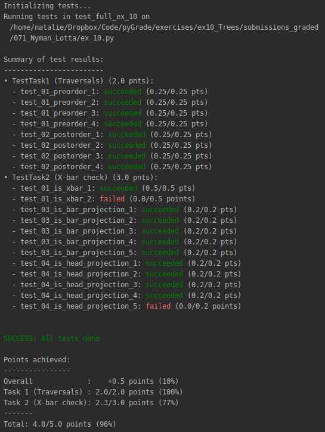
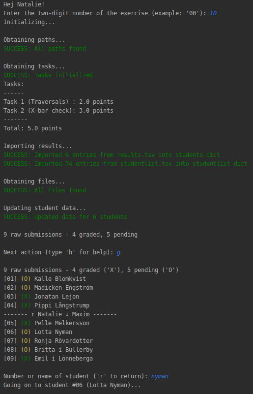

An interactive assistant for semi-auotmated grading of Python programming assignments.  

This tool can
  - adminster student submissions  
  - automatically assign a point score based on unit tests  
  - compile feedback into a Moodle-compatible format.
  
 
 

At the moment, pyGrade is not publicly accessible. If you are interested, please contact me.

© Natalie Clarius <natalie.clarius@student.uni-tuebingen.de>  
