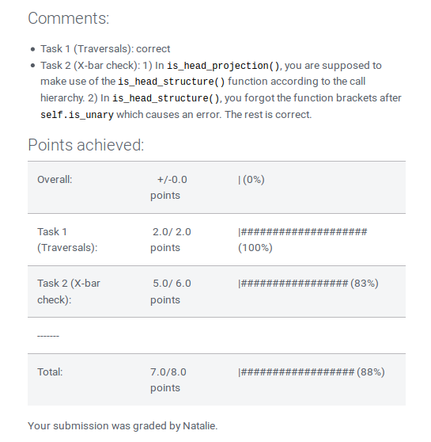

An assistant for semi-automated grading of Python programming assignments.  

This tool can
  - adminster student submissions  
  - automatically assign a point score based on unit tests  
  - compile feedback into a Moodle-compatible format.
  
 
 
 

© 2018 - 2025 Natalie Clarius \<<natalie_clarius@yahoo.de>\>  
