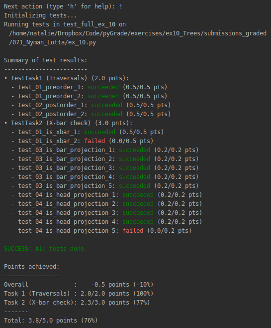

An assistant for semi-automated grading of Python programming assignments.  

This tool can
  - adminster student submissions  
  - automatically assign a point score based on unit tests  
  - compile feedback into a Moodle-compatible format.
  
 
 
 

At the moment, pyGrade is not publicly accessible. If you are interested, please contact me.

© Natalie Clarius \<<clarius@informatik.uni-tuebingen.de>\>  
